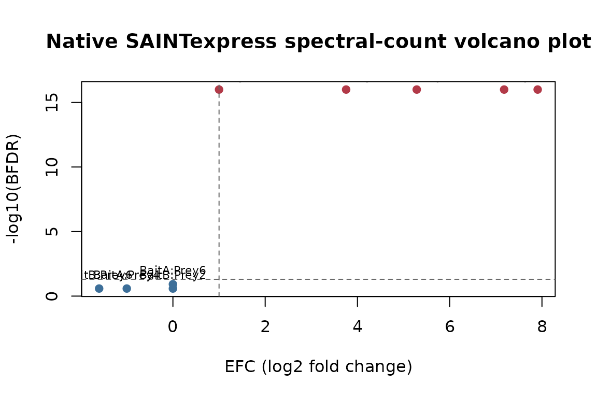
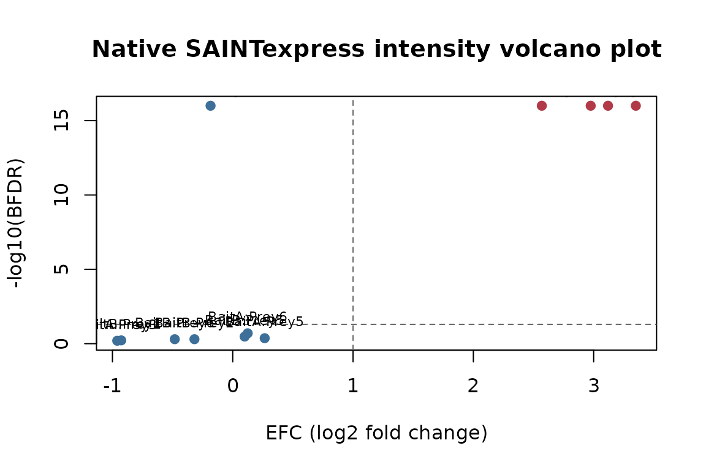

# Running native SAINTexpress on simulated input

This vignette runs the native `SAINTexpress-spc` and `SAINTexpress-int`
C++ binaries shipped by **saintexpressbin** on a small simulated AP-MS
experiment. The simulated dataset matches the one in [`saintexpress`’s
vignette](https://github.com/prolfqua/saintexpress) so you can compare
the native scores to the pure-R implementation directly.

## Check binary availability

``` r
saintexpressbin::saintexpress_executable("spc")
#> [1] "/home/runner/work/_temp/Library/saintexpressbin/bin/Linux64/SAINTexpress-spc"
saintexpressbin::saintexpress_executable("int")
#> [1] "/home/runner/work/_temp/Library/saintexpressbin/bin/Linux64/SAINTexpress-int"
saintexpressbin::saintexpress_available("spc")
#> [1] TRUE
```

The chunks below skip execution unless a native binary is resolvable for
the current platform.

## Simulate a small AP-MS experiment

Same generator as the `saintexpress` vignette.

``` r
simulate_si <- function(seed = 42, mode = c("spc", "int")) {
  mode <- match.arg(mode)
  set.seed(seed)
  preys  <- paste0("Prey", 1:6)
  baits  <- c("BaitA", "BaitA", "BaitB", "BaitB", "Ctrl1", "Ctrl2")
  ips    <- paste0("IP", seq_along(baits))
  cort   <- c("T", "T", "T", "T", "C", "C")

  draw <- function(bait, prey) {
    if (bait %in% c("Ctrl1", "Ctrl2")) {
      if (mode == "spc") stats::rpois(1, 0.5) else stats::rexp(1, 1 / 1e4)
    } else if (bait == "BaitA" && prey %in% c("Prey1", "Prey2")) {
      if (mode == "spc") stats::rpois(1, 20) else stats::rexp(1, 1 / 1e7)
    } else if (bait == "BaitB" && prey %in% c("Prey3", "Prey4")) {
      if (mode == "spc") stats::rpois(1, 15) else stats::rexp(1, 1 / 5e6)
    } else {
      if (mode == "spc") stats::rpois(1, 0.5) else stats::rexp(1, 1 / 1e4)
    }
  }

  rows <- list()
  for (i in seq_along(baits)) {
    for (p in preys) {
      q <- draw(baits[i], p)
      if (q > 0) {
        rows[[length(rows) + 1]] <- data.frame(
          ipId = ips[i], baitId = baits[i], preyId = p, quant = q,
          stringsAsFactors = FALSE
        )
      }
    }
  }
  list(
    inter = do.call(rbind, rows),
    prey  = data.frame(preyId = preys, preyLength = 500L, preyGeneId = preys,
                       stringsAsFactors = FALSE),
    bait  = data.frame(ipId = ips, baitId = baits, CorT = cort,
                       stringsAsFactors = FALSE)
  )
}
```

## Spectral-count scoring with the native binary

``` r
si_spc <- simulate_si(mode = "spc")
workdir <- tempfile("saintexpressbin-spc-")
dir.create(workdir)
res_spc <- saintexpressbin::saintexpress_run(
  si_spc,
  type = "spc",
  workdir = workdir,
  cleanup = TRUE,
  use_docker = FALSE
)
#> Input files are: /tmp/RtmpnA1WoS/saintexpressbin-spc-1d6adce171f/inter.txt, /tmp/RtmpnA1WoS/saintexpressbin-spc-1d6adce171f/prey.txt, /tmp/RtmpnA1WoS/saintexpressbin-spc-1d6adce171f/bait.txt
#> Interaction file: "/tmp/RtmpnA1WoS/saintexpressbin-spc-1d6adce171f/inter.txt"
#> Prey file: "/tmp/RtmpnA1WoS/saintexpressbin-spc-1d6adce171f/prey.txt"
#> Bait file: "/tmp/RtmpnA1WoS/saintexpressbin-spc-1d6adce171f/bait.txt"
#> GO file: ""
#> Parsing prey file /tmp/RtmpnA1WoS/saintexpressbin-spc-1d6adce171f/prey.txt ...done.
#> Parsing prey file /tmp/RtmpnA1WoS/saintexpressbin-spc-1d6adce171f/bait.txt ...done.
#> Parsing interaction file /tmp/RtmpnA1WoS/saintexpressbin-spc-1d6adce171f/inter.txt ...done.
#> Setting matrix indices for each interaction...done.
#> Creating matrix...done.
#> Creating a list of unique interactions...done.
res_spc$list[, c("Bait", "Prey", "AvgP", "BFDR", "SaintScore")]
#>    Bait  Prey AvgP BFDR SaintScore
#> 1 BaitA Prey1 1.00 0.00       1.00
#> 2 BaitA Prey2 1.00 0.00       1.00
#> 3 BaitA Prey4 0.00 0.26       0.00
#> 4 BaitA Prey6 0.05 0.12       0.05
#> 5 BaitA Prey5 0.38 0.00       0.38
#> 6 BaitB Prey3 1.00 0.00       1.00
#> 7 BaitB Prey4 1.00 0.00       1.00
#> 8 BaitB Prey2 0.00 0.26       0.00
#> 9 BaitB Prey6 0.00 0.26       0.00
```

Top hits per bait — the true interactors should rank first by `AvgP`:

``` r
top_per_bait <- function(df) {
  df <- df[order(df$Bait, -df$AvgP), ]
  do.call(rbind, by(df, df$Bait, head, 2))
}
top_per_bait(res_spc$list)[, c("Bait", "Prey", "AvgP", "BFDR")]
#>          Bait  Prey AvgP BFDR
#> BaitA.1 BaitA Prey1    1    0
#> BaitA.2 BaitA Prey2    1    0
#> BaitB.6 BaitB Prey3    1    0
#> BaitB.7 BaitB Prey4    1    0
```

## Spectral-count volcano plot

The native result includes `FoldChange` and `BFDR`. We plot the
effect-size coordinate (`EFC`, here `log2(FoldChange)`) against the
false-discovery coordinate.

``` r
plot_volcano <- function(scores, title) {
  volcano_data <- scores
  volcano_data$EFC <- log2(volcano_data$FoldChange)
  volcano_data$neg_log10_bfdr <- -log10(pmax(volcano_data$BFDR, 1e-16))
  volcano_data$is_hit <- volcano_data$BFDR <= 0.05 & volcano_data$EFC >= 1

  plot(
    volcano_data$EFC,
    volcano_data$neg_log10_bfdr,
    pch = 19,
    col = ifelse(volcano_data$is_hit, "#B23A48", "#3D6F99"),
    xlab = "EFC (log2 fold change)",
    ylab = "-log10(BFDR)",
    main = title
  )
  abline(h = -log10(0.05), lty = 2, col = "grey40")
  abline(v = 1, lty = 2, col = "grey40")
  text(
    volcano_data$EFC,
    volcano_data$neg_log10_bfdr,
    labels = paste(volcano_data$Bait, volcano_data$Prey, sep = ":"),
    pos = 3,
    cex = 0.7
  )
}
```

``` r
plot_volcano(res_spc$list, "Native SAINTexpress spectral-count volcano plot")
```



## Intensity scoring with the native binary

``` r
si_int <- simulate_si(mode = "int")
workdir <- tempfile("saintexpressbin-int-")
dir.create(workdir)
res_int <- saintexpressbin::saintexpress_run(
  si_int,
  type = "int",
  workdir = workdir,
  cleanup = TRUE,
  use_docker = FALSE
)
#> Input files are: /tmp/RtmpnA1WoS/saintexpressbin-int-1d6a287718ed/inter.txt, /tmp/RtmpnA1WoS/saintexpressbin-int-1d6a287718ed/prey.txt, /tmp/RtmpnA1WoS/saintexpressbin-int-1d6a287718ed/bait.txt
#> Interaction file: "/tmp/RtmpnA1WoS/saintexpressbin-int-1d6a287718ed/inter.txt"
#> Prey file: "/tmp/RtmpnA1WoS/saintexpressbin-int-1d6a287718ed/prey.txt"
#> Bait file: "/tmp/RtmpnA1WoS/saintexpressbin-int-1d6a287718ed/bait.txt"
#> GO file: ""
#> Parsing prey file /tmp/RtmpnA1WoS/saintexpressbin-int-1d6a287718ed/prey.txt ...done.
#> Parsing prey file /tmp/RtmpnA1WoS/saintexpressbin-int-1d6a287718ed/bait.txt ...done.
#> Parsing interaction file /tmp/RtmpnA1WoS/saintexpressbin-int-1d6a287718ed/inter.txt ...done.
#> Setting matrix indices for each interaction...done.
#> Creating matrix...done.
#> Creating a list of unique interactions...done.
#> L is larger than the number of control IPs.
top_per_bait(res_int$list)[, c("Bait", "Prey", "AvgP", "BFDR")]
#>           Bait  Prey AvgP BFDR
#> BaitA.1  BaitA Prey1    1    0
#> BaitA.2  BaitA Prey2    1    0
#> BaitB.9  BaitB Prey3    1    0
#> BaitB.10 BaitB Prey4    1    0
```

``` r
plot_volcano(res_int$list, "Native SAINTexpress intensity volcano plot")
```



## See also

For the pure-R implementation of the same scoring, see
[`saintexpress`](https://github.com/prolfqua/saintexpress). The two
engines are compared side by side on the TIP49 reference dataset in
`prolfquasaint`.

## Session information

``` r
sessionInfo()
#> R version 4.6.0 (2026-04-24)
#> Platform: x86_64-pc-linux-gnu
#> Running under: Ubuntu 24.04.4 LTS
#> 
#> Matrix products: default
#> BLAS:   /usr/lib/x86_64-linux-gnu/openblas-pthread/libblas.so.3 
#> LAPACK: /usr/lib/x86_64-linux-gnu/openblas-pthread/libopenblasp-r0.3.26.so;  LAPACK version 3.12.0
#> 
#> locale:
#>  [1] LC_CTYPE=C.UTF-8       LC_NUMERIC=C           LC_TIME=C.UTF-8       
#>  [4] LC_COLLATE=C.UTF-8     LC_MONETARY=C.UTF-8    LC_MESSAGES=C.UTF-8   
#>  [7] LC_PAPER=C.UTF-8       LC_NAME=C              LC_ADDRESS=C          
#> [10] LC_TELEPHONE=C         LC_MEASUREMENT=C.UTF-8 LC_IDENTIFICATION=C   
#> 
#> time zone: UTC
#> tzcode source: system (glibc)
#> 
#> attached base packages:
#> [1] stats     graphics  grDevices utils     datasets  methods   base     
#> 
#> loaded via a namespace (and not attached):
#>  [1] crayon_1.5.3          vctrs_0.7.3           cli_3.6.6            
#>  [4] knitr_1.51            rlang_1.2.0           xfun_0.58            
#>  [7] saintexpressbin_0.0.1 otel_0.2.0            textshaping_1.0.5    
#> [10] jsonlite_2.0.0        bit_4.6.0             glue_1.8.1           
#> [13] htmltools_0.5.9       ragg_1.5.2            sass_0.4.10          
#> [16] hms_1.1.4             rmarkdown_2.31        tibble_3.3.1         
#> [19] evaluate_1.0.5        jquerylib_0.1.4       tzdb_0.5.0           
#> [22] fastmap_1.2.0         yaml_2.3.12           lifecycle_1.0.5      
#> [25] compiler_4.6.0        fs_2.1.0              pkgconfig_2.0.3      
#> [28] htmlwidgets_1.6.4     systemfonts_1.3.2     digest_0.6.39        
#> [31] R6_2.6.1              tidyselect_1.2.1      readr_2.2.0          
#> [34] parallel_4.6.0        vroom_1.7.1           pillar_1.11.1        
#> [37] magrittr_2.0.5        bslib_0.11.0          bit64_4.8.2          
#> [40] tools_4.6.0           pkgdown_2.2.0         cachem_1.1.0         
#> [43] desc_1.4.3
```
